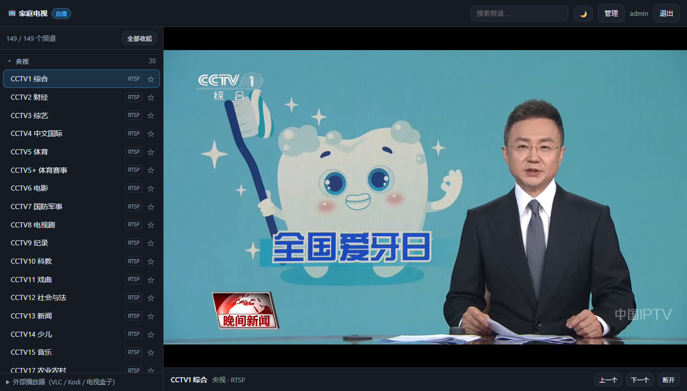
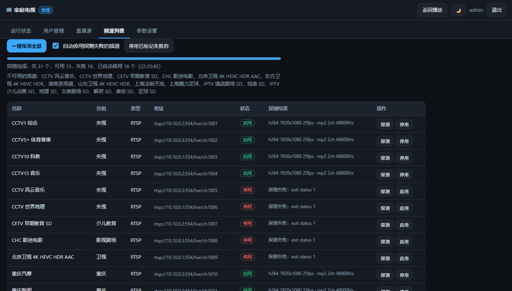
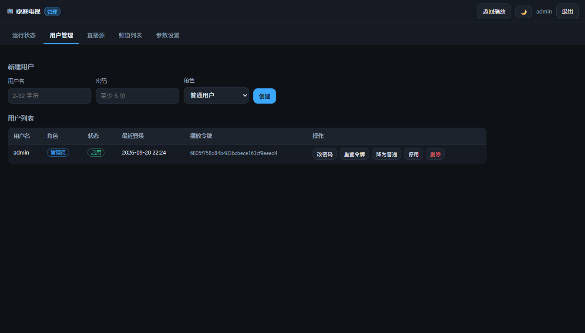
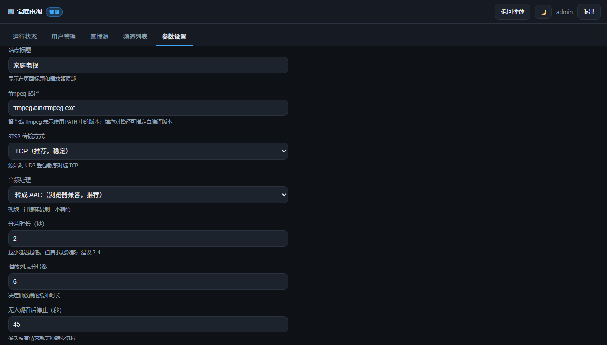
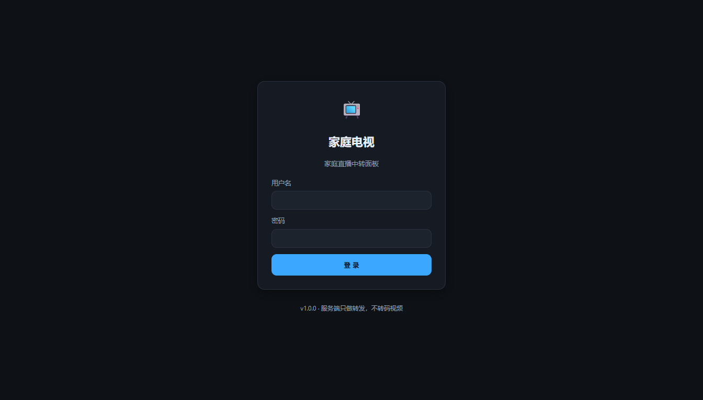

# tvhub

把**只有内网/专网才能访问的直播源**（RTSP / RTMP / UDP / HTTP）变成浏览器和电视盒子都能直接播放的直播面板。

> 源码：<https://github.com/hakureiyuyuko/go-tvhub> · 许可：[AGPL-3.0-only](LICENSE)

只做**转发**，不做视频转码：视频流原样复制（`-c:v copy`），一路 1080p 直播约占用 **5% 单核 CPU**（纯 remux 约 2%），一台家用设备可以同时转发好几路。

```
浏览器 / VLC ──HTTP──▶ tvhub ──RTSP─▶ 内网直播源
                        │
                        └── ffmpeg 把 RTSP 重新封装成 HLS（视频不转码）
```

## 界面截图

**播放页** —— 左侧频道列表（搜索 / 分组 / 收藏 / ↑↓ 换台），右侧 hls.js 播放，亮暗主题可切；电视盒子的遥控器就用上下键换台：



**频道列表 + 一键探测** —— 后台批量 ffprobe，探测失败的频道可自动停用（随时能再启用），结果直接写在列表里：



| 用户管理 | 参数设置 | 登录页（可选 Turnstile） |
| --- | --- | --- |
|  |  |  |

> 截图里是演示数据，源站地址已经抹成示例地址。

## 功能

- **播放页**：左侧频道列表（搜索、分组、收藏、上下键换台），右侧 hls.js 播放；暗色/亮色主题可切换。
- **服务端转发**：同一频道所有观众共享一路 ffmpeg 进程，不会因为多开网页就多拉几路源；无人观看 45 秒后自动回收进程并清理分片。
- **用户管理**：SQLite 存储，bcrypt 密码哈希，管理员/普通用户两种角色，会话 Cookie，登录失败限流（15 分钟内 10 次失败锁 10 分钟）。
- **播放列表管理**：管理员可以粘贴、上传或填写订阅地址导入 M3U，按地址增量更新（保留启用状态与收藏）；支持导出当前频道。
- **频道排障**：单频道一键 ffprobe 探测编码/分辨率/码率；也支持**一键探测全部**（后台任务 + 进度条，可关页面，只探启用中的频道），可自动停用探测失败的频道，也可事后再手动「停用已标记失败的」。
- **外部播放器**：每个用户有独立播放令牌，可把 `/s/<token>/playlist.m3u` 丢给 VLC / Kodi / 电视盒子，不需要登录；令牌可重置。
- **HTTP 源反向代理**：`http(s)` 频道直接反代，m3u8 里的分片地址会自动改写为带签名的代理地址（防止被当成任意地址跳板）；`rtsp/rtmp/udp` 走 HLS。
- 零外部依赖（除 ffmpeg），单文件二进制，前端全部内嵌。

## 运行要求

- **ffmpeg**（必需，用于 RTSP/RTMP/UDP → HLS 的重新封装；也提供 ffprobe 探测）
  - **Windows 懒人包**：本目录已经放了一份可用的 ffmpeg（`ffmpeg\bin\ffmpeg.exe` 与 `ffprobe.exe`），程序启动时会自动发现并填入设置，不用配置 PATH。
  - 自己装：`winget install Gyan.FFmpeg`（装完要重开终端），或用 `scoop install ffmpeg`。
  - Debian/Ubuntu：`apt install -y ffmpeg`；RHEL/Rocky：`dnf install -y ffmpeg`；OpenWrt/ImmortalWrt：`opkg install ffmpeg` 或 `apk add ffmpeg`。
  - 也可以在面板“参数设置 → ffmpeg 路径”里填绝对路径（Windows 上写 `C:\ffmpeg\bin\ffmpeg.exe` 这种反斜杠形式或正斜杠都行）。
- 运行机器必须**能访问直播源**（通常是运营商内网/家庭网关所在的网络）。

## 快速开始

Windows（本目录已带 `dist\tvhub-windows-amd64.exe`，或者直接用 `tvhub.exe`）：

```powershell
.\tvhub.exe -data .\data -import .\channels.m3u
```

Linux：

```bash
./tvhub -addr :8099 -data ./data -import ./channels.m3u
```

首次启动会自动创建管理员（用户名 `admin`），密码随机生成并打印在控制台：

```
================ 初始管理员账号 ================
  用户名：admin
  密  码：xxxxxxxxxxxx
（登录后请在"用户"页修改密码）
===============================================
```

也可以自己指定：`-admin-pass '你的密码'`；忘了密码就 `-reset-admin-password` 重置。
然后浏览器打开 `http://<服务器IP>:8099/`。

## 命令行参数

| 参数 | 默认值 | 说明 |
| --- | --- | --- |
| `-addr` | `:8099` | 监听地址（环境变量 `TVHUB_ADDR`） |
| `-data` | `data` | 数据目录，存放 `tvhub.db` 与 `hls/` 分片（`TVHUB_DATA`） |
| `-import` | 空 | 启动时导入该 m3u 文件 |
| `-ffmpeg` | 空 | ffmpeg 路径；提供后每次启动都会写入设置，优先级高于面板 |
| `-admin-user` / `-admin-pass` | `admin` / 随机 | 首次启动创建的管理员 |
| `-reset-admin-password` | 否 | 重置管理员密码后退出 |
| `-base-url` | 空 | 对外地址，如 `http://192.168.1.10:8099`，用于生成外部播放链接 |
| `-tls-cert` / `-tls-key` | 空 | 同时提供则启用 HTTPS（Cookie 会自动加 Secure） |
| `-debug` | 否 | 打印调试日志 |
| `-version` | 否 | 显示版本 |

## 面板参数（管理 → 参数设置）

| 参数 | 默认 | 说明 |
| --- | --- | --- |
| ffmpeg 路径 | `ffmpeg` | 留空表示走 PATH；可填绝对路径 |
| RTSP 传输方式 | `tcp` | 源站 UDP 丢包时选 TCP 更稳 |
| 音频处理 | 转 AAC | 视频永远直通。源站常见 MP2/AC3 音频，浏览器放不了，所以默认只转码音频；确定播放端支持（如 VLC）可改成"原样复制"，CPU 占用再降一半 |
| 分片时长 | 2 秒 | 越低延迟越低 |
| 播放列表分片数 | 6 | 播放端缓冲长度 |
| 无人观看后停止（秒） | 45 | 多久没有请求就关掉转发进程 |
| 探测超时（秒） | 15 | 源站不给你看的频道会一直挂着不响应，这个值直接决定一键探测跑多快；能正常播的频道通常 1 秒内就返回，可以调到 5-8 秒 |
| 最大并发转发路数 | 8 | 超了会替换最久没看的；全都在看则拒绝新请求 |
| 追加 ffmpeg 参数 | 空 | 例：`-rtsp_flags prefer_tcp` |
| 登录页启用 Cloudflare Turnstile | 关闭 | 勾选后在登录页接入人机验证，并显示下面两个密钥输入框 |
| Turnstile 站点密钥（Site Key） | 空 | Cloudflare 控制台 → Turnstile → 添加站点得到，可公开 |
| Turnstile 密钥（Secret Key） | 空 | 同一页面上的 Secret，只存在本机数据库 |

## 部署到 Linux（systemd）

```bash
sudo install -m 0755 dist/tvhub-linux-amd64 /usr/local/bin/tvhub
sudo mkdir -p /etc/tvhub /var/lib/tvhub
sudo cp channels.m3u /etc/tvhub/channels.m3u
sudo cp deploy/tvhub.service /etc/systemd/system/
sudo systemctl daemon-reload
sudo systemctl enable --now tvhub
journalctl -u tvhub -f      # 首次启动的随机管理员密码在这
```

unit 文件以 root 运行但做了加固：`StateDirectory=tvhub` 自动建并授权数据目录、`ProtectSystem=strict` 只读整个系统盘、`PrivateTmp` 隔离临时目录、`NoNewPrivileges`。如果你的发行版不支持这些指令，去掉即可。

## 自己编译

仓库里 `dist/` 已经放了交叉编译好的二进制；要自己编（需要 **Go 1.26+**，因为 `golang.org/x/crypto` 要求）：

```bash
make build          # 当前平台 -> tvhub / tvhub.exe
make dist           # 产出 linux/amd64、linux/arm64、linux/arm、windows/amd64
make test
```

PowerShell（没有 make 时）：

```powershell
$env:CGO_ENABLED='0'
go build -trimpath -ldflags "-s -w" -o dist\tvhub-windows-amd64.exe .
$env:GOOS='linux'; $env:GOARCH='amd64'; go build -trimpath -ldflags "-s -w" -o dist/tvhub-linux-amd64 .
```

> 用了纯 Go 的 SQLite 驱动（modernc.org/sqlite），所以 `CGO_ENABLED=0` 就能交叉编译，不需要 gcc。

## 已验证

在一台能访问内网 IPTV 单播源的 Windows 机器上做过完整验收（64 项 HTTP/业务断言 + 无头 Chrome 真实起播）：

- RTSP → HLS：首次点播 1.6~1.8 秒出画面，分片 `video/mp2t`，1920×1080 H.264 直通 + AAC 音频；
- 无头 Chrome 播放：`readyState=4`、`videoWidth=1920`、时间轴正常推进；
- 两路并发、共享同一路会话、空闲 10 秒后自动回收并清理分片目录；
- 权限：未登录 401、普通用户访问管理接口 403、被停用用户会话立即失效、伪造播放令牌 403、代理子地址签名校验；
- 资源占用：1080p（~8.5 Mbps）一路 **5.2% 单核**（音频转 AAC）、**2.0% 单核**（纯 remux），ffmpeg 常驻内存 27 MB，tvhub 本体 17 MB。
- Cloudflare Turnstile：用官方测试密钥在浏览器里真实完成人机验证并登录成功；缺 token 被拒；"始终拦截"密钥下登录被拒（19 项断言）。
- 一键探测 + 自动停用：用 3 个真源 + 3 个假源验证——探测并发执行、进度实时上报、结果写入数据库、失败自动停用、事后一键停用、重复启动返回 409（16 项断言）。

## 频道健康检查（一键探测）

管理 → 频道列表：

- **一键探测全部**：服务端后台任务，6 个并发调 ffprobe（避免给源站开太多会话），进度实时回传，可以关掉页面去忙别的；只探测当前**启用中**的频道。
- ☑ **自动停用探测失败的频道**（默认勾选）：探测失败的频道会被自动停用，用户端立刻看不到；随时可以在列表里点「启用」恢复。
- **停用已标记失败的**：如果你第一次只想看看结果（取消勾选），之后再点这个按钮，按数据库里已有的探测结果批量停用，不用重新探测。
- 探测结果（编码/分辨率/帧率/音频/码率）会写进数据库，列表里直接能看到，换机器/重启都不会丢。
- 中途可点「取消」，已在跑的几条会自然结束。

> 探测 149 个频道大约 2-4 分钟（坏源要等到超时；默认并发 3、每次错开 500ms，是为了不给源站太大压力）。**不要反复跑全量探测**：IPTV 服务器对会话数量敏感，高频探测可能被临时封禁整条线路。

## 登录保护（Cloudflare Turnstile）

管理员在 **管理 → 参数设置 → 登录页启用 Cloudflare Turnstile 人机验证** 勾选后，下面会自动出现两个输入框：

```
☑ 登录页启用 Cloudflare Turnstile 人机验证
   Turnstile 站点密钥（Site Key）   →  在 Cloudflare 控制台创建 Turnstile 站点后获得
   Turnstile 密钥（Secret Key）     →  同一页面上的 Secret，不要泄露
```

行为说明：

- 只有 **勾选 + 两个密钥都填了** 才会真正强制校验；只开启没填密钥时登录页会提示“当前不会强制校验”，避免管理员把自己锁在外面。
- 没完成验证 / token 过期，登录会被拒绝并显示 Cloudflare 返回的原因（如“验证无效，站点密钥或密钥配置有误”）。
- **需要客户端能访问 `challenges.cloudflare.com`**：纯内网/断网环境用不了，页面上的组件会加载失败。
- 服务端校验请求超时或网络不通时，本次登录会**放行并在日志里告警**（宁可留个口子，也不要在断网的节假日把全家关在门外）。要清除这个口子就关掉开关。
- 关掉开关后密钥会保留在数据库里（只是隐藏），以后重新勾选就回来了。

## 安全说明

- 这是给**内网/家庭**用的面板：默认 HTTP（密码明文过网），如需暴露到局域网之外，请配 `-tls-cert/-tls-key` 或挂在带 HTTPS 的反向代理后面。
- 只有 `http(s)` 源会被反向代理由服务器主动请求，且子地址必须带上服务器签名的 HMAC，用户无法用代理去探测别的地址。
- 播放令牌等同于密码，泄露后可播放全部频道；在"用户"页可一键重置。
- 直播源地址里的鉴权参数（如 `AuthInfo`）、运营商账号等信息在数据库和 m3u 里是明文，注意别把 `data/` 和 m3u 提交到公开仓库（`.gitignore` 已包含）。

## 目录结构

```
main.go                     启动、参数、首次初始化、优雅退出
ffmpeg/bin/                 随程序携带的 ffmpeg（可删，删除后走 PATH）
internal/m3u/               M3U 解析、分组推断、导出
internal/store/             SQLite：用户、会话、频道、收藏、设置
internal/auth/              bcrypt、会话 Cookie、登录限流
internal/stream/            ffmpeg 会话管理（HLS）与 HTTP 反向代理、ffprobe 探测
internal/config/            设置项 <-> 运行时参数
internal/webui/             路由、鉴权中间件、JSON 接口、内嵌模板与静态资源
internal/webui/templates/   页面模板（登录/播放/管理）
internal/webui/static/      style.css、app.js、player.js、admin.js、hls.min.js
deploy/tvhub.service        systemd 单元示例
```

## 常见问题

**点播后提示"启动 ffmpeg 失败"** — 面板"参数设置"里的 ffmpeg 路径不对，或机器上没有 ffmpeg。本目录自带的 `ffmpeg\bin\ffmpeg.exe` 会被自动识别；若路径被填错，改成绝对路径最省事，或者重启时加 `-ffmpeg 路径`。

**能出播放列表但一直转圈** — 源站可能需要 UDP：把 RTSP 传输方式改成 `udp`；或者在"频道列表"点"探测"看源站到底返回什么。

**4K HEVC 频道放不出来** — HEVC 在 Chrome/Firefox 的 MSE 里不支持（Safari 原生 HLS 可以）。这类频道建议用外部播放器（VLC/Kodi）播放，或者自己去 ffmpeg 加转码参数。

**音频没有声音** — 源站是 MP2/AC3 时请保持"音频处理=转 AAC"。

**一键探测跑完，发现有些频道明明是好的却被停用了** — IPTV 服务器对并发会话数量很敏感：并发探得大时可能返回 `562 (Wait MLSS TimeOut)` 之类的繁忙错误，被误判为失败。默认已经压到 3 并发、每次错开 500ms；如果你的源站比较娇气，把「探测超时」调大、甚至改用单个频道逐个探测更稳。

**探测/播放一通之后，所有频道都连不上了（No route to host）** — 源站把这条线路临时封了。停止一切重试，等几分钟到几十分钟；如果机顶盒也一起黑屏（说明同一会话被波及），重启光猫/路由器换个会话/公网 IP 通常能立刻恢复。教训：不要反复跑全量探测。

**外部播放器（VLC）播放列表里的频道都放不了** — 检查 `-base-url` 是否填成播放器能访问到的地址（尤其是前面挂了反向代理时）。

## 第三方组件

- [hls.js](https://github.com/video-dev/hls.js) v1.6.15（Apache-2.0）—— 浏览器端 HLS 播放器，原样内嵌在 `internal/webui/static/hls.min.js`，归属说明见同目录的 `hls.min.js.LICENSE.txt`。
- Go 依赖只有两个：`modernc.org/sqlite`（BSD-3-Clause，纯 Go 的 SQLite 驱动）和 `golang.org/x/crypto`（BSD-3-Clause，bcrypt）。其余全部来自标准库。
- 前端零框架、零构建步骤，`app.js` / `player.js` / `admin.js` / `style.css` 都是手写的。

## 发版（自己发一个 Release）

推一个 `v*` 标签就会自动发版——CI 会跑测试、交叉编译四个平台、生成 `SHA256SUMS.txt` 并建 Release：

```bash
git tag v1.0.1
git push origin v1.0.1
```

工作流在 `.github/workflows/release.yml`，用的是 runner 自带的 `gh` CLI，不需要装任何东西。想本地产出二进制用 `make dist`。

## 许可证

[AGPL-3.0-only](LICENSE) © 2026 hakureiyuyuko

简而言之：随便用、随便改、自己家里怎么部署都行；但如果你改了它并作为**网络服务**提供给别人使用，就必须把改动后的完整源码以同样的协议公开。
